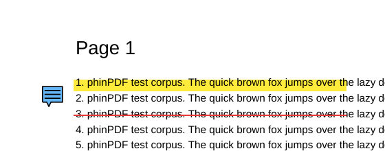

# Interoperability: Annotations in Other Apps

Phase 3 exit gate: annotated files round-trip without loss and render correctly in at least
3 other viewers.

## Automated (every CI run)

| Check | Tool | Engine also used by | Test |
|---|---|---|---|
| Save → reopen: kinds, colours, comments, authors, dates, positions | PDF.js | Firefox | `packages/editor/src/engine.test.ts` |
| Edit and delete annotations made by other apps; other types untouched | PDF.js, PDFium | Firefox, Chrome, Edge | `engine.test.ts` |
| Encrypted files stay encrypted (AES-256, AES-128, RC4) with the same password | PDF.js, qpdf | — | `engine.test.ts`, `interop.test.ts` |
| File structure valid | qpdf `--check` | — | `interop.test.ts` |
| Highlights, underlines, and notes are drawn | Poppler `pdftoppm` | Okular, Evince | `interop.test.ts` |
| End to end in the app: highlight, comment, save, reopen | Chromium, Firefox, WebKit | — | `apps/web/e2e/annotations.spec.ts` |

PDFium writes the files. It is also the engine in Chrome and Edge, so files that PDFium
reads back cleanly are a good sign for those browsers as well.

Poppler drawing a file saved by phinPDF:

## Manual checklist (before each release)

Save a file in phinPDF with a highlight, an underline, and a note, each with a comment.
Also save a password-protected file. Then open both in each app and tick the boxes.

| App | Highlight shown | Underline shown | Note icon shown | Comments readable | Can edit or delete | Password still required |
|---|---|---|---|---|---|---|
| Adobe Acrobat Reader (Windows) | | | | | | |
| Microsoft Edge (Windows) | | | | | | |
| Okular (Linux) | | | | | | |
| Evince / GNOME Papers (Linux) | | | | | | |
| Chrome | | | | | | |
| Firefox | | | | | | |

Record the app versions and any differences here, and open an issue for each problem.
