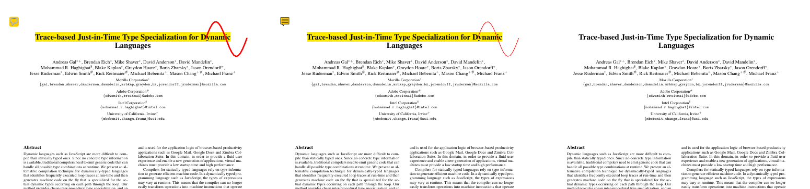
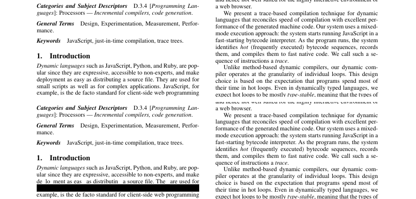

# Phase 0 Technical Spike Report

- **Date:** 2026-10-07
- **Code:** [`spikes/`](../../spikes/) (throwaway, not production code)
- **Environment:** Linux container, 4 vCPU, 15 GB RAM, no GPU (software rendering).
  Headless Chromium 141, WebKitGTK 2.52.6, Node 22, Rust 1.97.
- **Not tested here:** Windows. No Windows machine was available. Windows checks move to
  the Phase 1 CI matrix (see "Follow-ups").

## Summary

| Spike | Question | Answer |
|---|---|---|
| 1. Render performance | Can PDF.js handle a 500+ page PDF fast enough? | **Yes, with work.** First page in 0.7 s for a 34.7 MB / 504-page file. Memory and main-thread jank need tuning |
| 2. Edit round-trip | Can we add annotations, fill forms, and save files that other viewers read? | **Yes, with PDFium-WASM.** pdf-lib works for basics but fails on encryption and can't redact |
| 3. Tauri shell | Can the desktop app open a file and pass it to PDF.js securely? | **Yes.** 2.5 MB `.deb`, binary IPC, PDF.js works in WebKitGTK, lockdown confirmed |

**Decisions that change the plan:**

1. **Editing engine:** PDFium-WASM (`@embedpdf/pdfium`) becomes the **primary** editing
   engine instead of pdf-lib. See [ADR-0004](../adr/0004-editing-engine.md).
2. **PDF.js build:** ship the **legacy** (polyfilled) build. The modern PDF.js 6 build
   crashes on Chromium 141. See [ADR-0007](../adr/0007-pdfjs-build-and-browser-support.md).
3. **Security config:** PDF.js 6 removed `isEvalSupported` and no longer uses `eval`.
   The control is now a strict CSP without `unsafe-eval`, which the spikes verified.

---

## Spike 1: PDF.js render performance

**Setup:** Real-world content is Mozilla's `tracemonkey.pdf` from the PDF.js test suite
(14 pages, embedded fonts and charts), copied 36x to make 504 pages / 34.7 MB. Fonts are
not shared between copies, so this file is a heavy stress case. A synthetic file has
1,000 text-heavy pages. Pages render at 1.5x zoom (918 px wide) with a virtualized window
of 5 live canvases, the way the real viewer will scroll. The page runs under a strict CSP
(`script-src 'self'`, no `unsafe-eval`).

| File | Pages | Size | Open | First page visible | Render p50 / p95 / max (ms) | Pages/s | Main-thread tasks > 50 ms (longest) | Extract text, all pages | Peak memory above idle browser |
|---|---|---|---|---|---|---|---|---|---|
| tracemonkey | 14 | 1.0 MB | 224 ms | 371 ms | 83 / 283 / 283 | 10.2 | 1 (111 ms) | 0.2 s | +193 MB |
| real-504p | 504 | 34.7 MB | 564 ms | **731 ms** | 60 / 191 / 453 | 13.3 | **25 (252 ms)** | **6.3 s** | **+549 MB** |
| synthetic-1000p | 1,000 | 1.5 MB | 440 ms | 515 ms | 42 / 59 / 92 | 23.5 | 1 (62 ms) | 6.2 s | +248 MB |

Memory is the summed RSS of all Chromium processes, minus an idle browser (677 MB). Summed
RSS counts shared memory more than once, so these are upper bounds. JS heap stayed
under 10 MB; nearly all memory is canvases and font/image caches.

**Findings:**

- ✅ **First-page budget (< 1 s for a 10 MB file) is met** even at 34.7 MB.
- ✅ **No CSP violations.** PDF.js works without `eval` and without inline scripts.
- ⚠️ **Memory budget (< 500 MB) is slightly exceeded** on the 504-page stress file.
  Fixes for Phase 2: cap the render cache, call `PDFDocumentProxy.cleanup()` when scrolling
  far, and render at screen resolution only.
- ⚠️ **Main-thread jank on complex pages:** 25 tasks over 50 ms, up to 252 ms, which is a
  visible stutter. Fix for Phase 2: render with `OffscreenCanvas` inside the worker, and
  show a low-resolution placeholder while scrolling fast.
- ⚠️ **Full-text search takes about 6 s** on 500–1,000 pages. Search must be incremental:
  show results as pages are scanned, cache extracted text, and search the visible page first.
- ❌ **The modern PDF.js 6 build crashes on Chromium 141** with
  `Map.prototype.getOrInsertComputed is not a function`. The legacy build polyfills it and
  works. See ADR-0007.

## Spike 2: Edit, save, and reopen

**Setup:** Each engine adds a highlight, a sticky note, and an ink drawing to page 1 of
tracemonkey, fills a text field and checkbox, edits an AES-256 encrypted copy, and
annotates the 504-page file. Every output is checked by three tools that are independent
of the engine that wrote it:

- `qpdf --check` for structural validity.
- PDF.js for annotation types and form values.
- Poppler rendering with pixel checks. Poppler is the engine behind Okular and Evince, the
  main Linux viewers.

| Scenario | pdf-lib 1.17.1 | @cantoo/pdf-lib 2.11.1 | PDFium-WASM (@embedpdf/pdfium 2.15.1) |
|---|---|---|---|
| Maintenance | ❌ Last release May 2022 | ✅ Maintained fork (Sept 2026) | ✅ Active (Sept 2026). PDFium is Google's engine used in Chrome |
| Annotation API | ❌ None. Raw dictionaries and appearance streams written by hand | ❌ None (same as pdf-lib) | ✅ Native API, generates appearances |
| Annotations: valid file, readable, rendered by Poppler | ✅ | ✅ | ✅ |
| Form fill: value saved and drawn by Poppler | ✅ | ✅ | ✅ after a fix: setting the value directly leaves the field **blank in Poppler**. Simulating typing (`FORM_ReplaceSelection`) works |
| AES-256 encrypted input | ❌ Refuses to load | ⚠️ Loads, but **saves the file decrypted**, silently removing the password | ✅ Loads, and output stays encrypted |
| 504 pages / 33 MB: load, annotate, save | 3.1 s | 8.3 s | **1.8 s** (output +1.4 MB) |
| True redaction (remove text from content) | ❌ Can't edit content streams | ❌ | ✅ Text removed, rest of page intact |
| Size added to web app (gzip) | 201 KB | 246 KB | 2.1 MB wasm + 61 KB JS |
| License | MIT | MIT | MIT wrapper + Apache-2.0 PDFium |

Rendered by Poppler. Left: pdf-lib annotations. Middle: PDFium annotations. Right: PDFium redaction
output (the title area is unchanged):



**Redaction finding.** Top: original. Bottom: after PDFium redaction of one line. The
target line is gone from the text layer and replaced by a black bar. But the **line above
lost letters** ("de lo ment as eas"), because the redaction box overlapped their
descenders, and PDFium removes any glyph whose box touches the area:



Requirements for the Phase 4 redaction tool:

- Select text by exact character boxes (`EPDFText_RedactInQuads`), not by a padded rectangle.
- Show a preview of exactly which characters will be removed before applying.
- Verify after saving with automated text extraction.

## Spike 3: Tauri desktop shell (Linux)

**Setup:** A minimal Tauri 2.12 app receives a PDF path on the command line, the same way
"Open with" and double-click do. A Rust command returns the bytes over Tauri's binary IPC,
and the webview renders page 1 with PDF.js. The app has only `core:default` plus its two
commands. No fs, shell, http, or dialog plugins are included.

| Check | Result |
|---|---|
| Build (cold) | Debug 2 m 42 s, release 3 m 52 s |
| Release binary / `.deb` installer | **5.6 MB / 2.5 MB** (includes both PDF.js builds) |
| IPC, 1 MB file | 19 ms |
| IPC, 34.7 MB file (debug build) | 487 ms |
| PDF.js modern and legacy builds in WebKitGTK 2.52 | ✅ Both render (page 1 of 504 in about 0.85 s) |
| Non-PDF file passed in | ✅ Rejected in Rust before reaching the webview |
| `plugin:fs` read of `/etc/passwd` | ✅ Blocked |
| `plugin:shell` execute | ✅ Blocked |
| `fetch('https://example.com')` | ✅ Blocked by CSP |
| `eval()` | ✅ Blocked by CSP |

**Findings:**

- ✅ Tauri is confirmed for the desktop shell. The installer is about 60x smaller than a
  typical Electron app.
- ✅ Custom commands are denied unless listed in a capability file, once they are declared
  in `build.rs` with `AppManifest::commands`. **Without that, Tauri allows every custom
  command by default.** Phase 5 must keep this pattern.
- ❌ **Tauri's default Linux desktop entry breaks double-click opening.** It writes
  `Exec=phinpdf-spike` with no `%F`, so the file manager launches the app without the file.
  Fixed in the spike with a custom template (`linux.desktop.hbs`). The fixed file passes
  `desktop-file-validate`.
- ⚠️ Spaces in `productName` end up in the `.desktop` filename. Use `phinPDF` (no spaces).
- ⚠️ For files over about 100 MB, consider streaming bytes to PDF.js with range requests
  through a custom protocol instead of a single IPC transfer.

## Follow-ups

| # | Action | Phase |
|---|---|---|
| 1 | Add Windows (WebView2) to the CI matrix and run spike 3 there: build, IPC, PDF.js, lockdown checks | 1 |
| 2 | Add Firefox and WebKit to the spike 1 benchmark in CI (only Chromium was available here) | 1 |
| 3 | Re-run spike 1 with `OffscreenCanvas` rendering and a capped cache; target < 500 MB and no tasks over 100 ms | 2 |
| 4 | Check annotations and forms in Acrobat Reader and Edge on Windows (manual) | 3 |
| 5 | Build PDFium-WASM from source in CI as a fallback to the npm package (supply-chain risk) | 1–2 |
| 6 | Decide whether PDF.js or PDFium does rendering long-term (two parsers = two attack surfaces) | Revisit after Phase 2 |

## Reproducing

```sh
cd spikes && npm ci
# Fixtures: download tracemonkey.pdf from the PDF.js repo, then build the large files
node 01-render-perf/make-fixtures.mjs <tracemonkey.pdf> <fixturesDir>
node 01-render-perf/run.mjs <fixturesDir> tracemonkey.pdf real-504p.pdf synthetic-1000p.pdf
node 02-edit-roundtrip/run.mjs <fixturesDir> <outDir>      # needs qpdf and poppler-utils
cd 03-tauri-ipc && ./prepare.sh && cd src-tauri && cargo build
xvfb-run -a target/debug/phinpdf-spike <file.pdf>          # prints SPIKE_RESULT {...}
```

Raw results: `spikes/01-render-perf/results.json`, `spikes/02-edit-roundtrip/results.json`.
